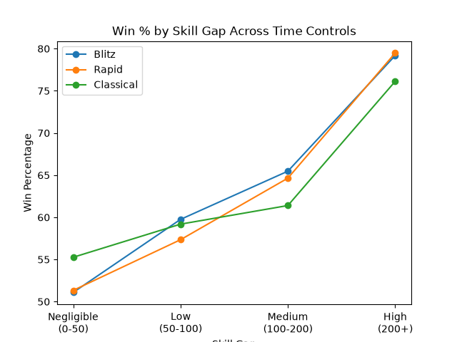
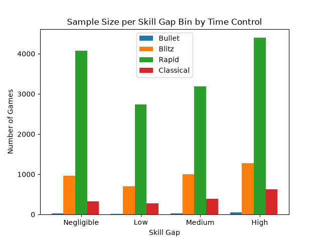

# Chess Time Control vs. Rating Gap Analysis

Analysis of how time control affects the relationship between rating gap and win percentage in online 
chess, using pandas and matplotlib.

## Research Question
Does time control widen or narrow the effect of rating gap on win percentage?

## Key Finding
While time control has a negligible impact on the predictive power of rating gaps in Blitz and Rapid, 
it becomes a measurable factor in Classical games.

## Results
- Blitz: 28.10 percentage point spread (win% at High rating gap vs. Negligible)
- Rapid: 28.15 percentage point spread
- Classical: 20.87 percentage point spread (~7.3pp lower than Blitz/Rapid)
  
## Methodology
- Dataset: online chess games (games.csv)
- Tools: pandas, matplotlib
- Players categorized by rating gap (Negligible/Low/Medium/High) and games categorized by time control 
(Bullet/Blitz/Rapid/Classical)
- Bullet excluded from analysis due to insufficient sample size (131 games)
- Dataset source: [Chess Game Dataset (Lichess)](https://www.kaggle.com/datasets/datasnaek/chess) — Kaggle

## How to Run
pip install pandas numpy matplotlib
python Chess_Time_Control_Analysis.py
## Charts

## Full Writeup
See [writeup.md](writeup.md) for the complete analysis and recommendation.

## Author
Jaden Ko — [GitHub](https://github.com/Jadenmko)
